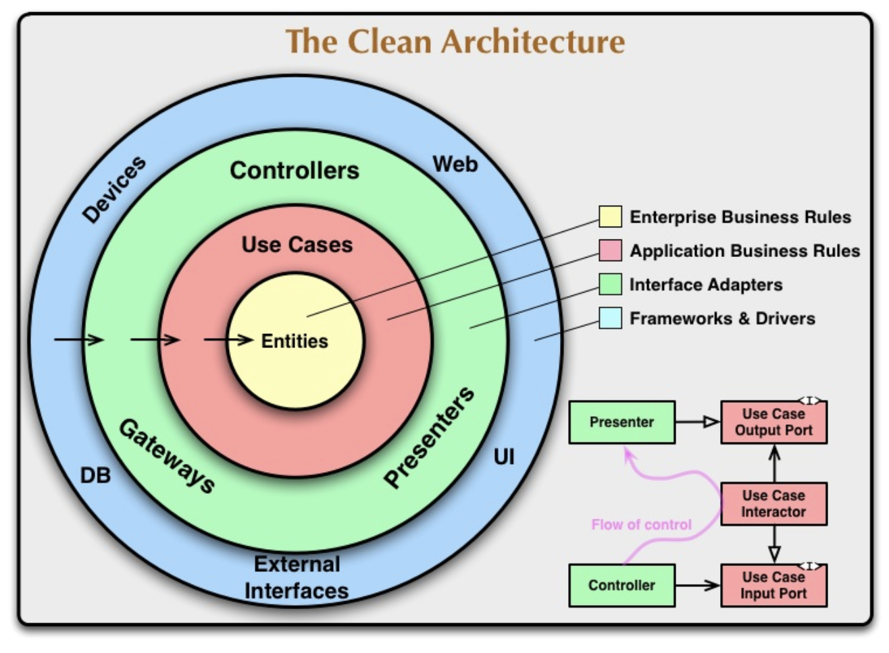

<p align="center">
  <a href="http://nestjs.com/" target="blank"></a>
</p>

# Referencia técnica 
## Prerequisitos
* Node Js v12
* Npm v8
* Nest v
## Instalación de Cli Nest

```bash
$ npm i -g @nestjs/cli
```
## Instalación de librerias

```bash
$ npm install
```
## Compilar
```bash
$ npm run build
```
## Ejecutar aplicación

```bash
# development
$ npm run start

# watch mode
$ npm run start:dev

# production mode
$ npm run start:prod
```

## Librerias instaladas
* @nestjs/mongoose
* @nestjs/swagger
* @nestjs/typeorm
* mongoose
* mssql
* swagger-ui-express
* typeorm
* class-transformer
* class-validator

## Variables de Entorno

* NOSQL_HOST
* NOSQL_PORT
* NOSQL_USER
* NOSQL_PASSWORD
* NOSQL_DATABASE
* NOSQL_SSL
* NOSQL_APPNAME

# Arquetipo Clean Architecture Nest JS

El presente arquetipo tiene como objetivo servir como template base para la implementación de desarrollos basado en tecnología NestJs bajo el concepto de Arquitectura Limpia (Clean Architecture).



Basado en la definición de Clean Architecture son definido tres carpetas base considerando las capas de Domain, Infrastructure, UseCases que dan soporte a toda la arquitectura de dominio. 
## Domain
Define los elementos de Negocio (Dominio) de nuestra carpeta. Todo elemento core de negocio y comportamiento de esta se encuentra definido aqui. Esta implementación no depende de ningun otro componente, debe ser practicamente independiente del framework a utilizar.  A continuación son definidos las carpetas base y su proposito:

* <b>config:</b> contiene las interfaces de configuracion , con el acceso a las diferentes propiedades para conectores. 
* <b>exceptions:</b> interfaces que contiene definen comportamiento de manejo de excepciones.
* <b>logger:</b> interfaces que definen compatamiento de manejo de logger.
* <b>model:</b> definición de las entidades de negocio.
* <b>repositories:</b> interfaces que definen el comportamiento de los repositorios de entidad.

## Infrastructure
Esta carpeta contiene las implementaciones de los adaptadores para conexión de datos, servicios. Tambien aqui se encuentran otras implementaciones como Excepciones, interceptores, filter, entre otros. Por ultimo, se encuentra la implementación de los servicios ApiRest.
Esta carpeta se organiza de la siguiente forma:

* <b>Common:</b> posee las implementaciones de los filter, interceptors y swagger.
* <b>config:</b> contiene la definicion de configuración de los adaptadores de datos. En este caso typeorm y mongoose.
* <b>controllers:</b> Implementación del servicio apirest. En este se define el controlador, los dto para parametros de entrada y el presenter como respuesta.
* <b>entities:</b> entidades de persistencia utilizados por Type ORM.
* <b>Exceptions:</b> Contiene la definición del manejo de excepciones.
* <b>logger:</b> Implementación de Logger.
* <b>repositories:</b> Implementación del Patron Repository de la capa persistencia.
* <b>schemas :</b> Esquemas de persistencia relacionada al trabajo con MongoDB con proveedor Mongoose.
* <b>usecases-proxy :</b> Módulo que realiza la operación de inyección de dependencia para Nest.

## Usescase
En esta carpeta es donde son implementados los casos de uso. Estos deben ser organizados por carpetas con el nombre de la entidad core del caso de uso. A continuación, un ejemplo de la organizacion:

  
    usescases 
    - document-example
      - get-document-example-by-number-document.usecase.ts
      - post-document-example-create.usecases.ts
